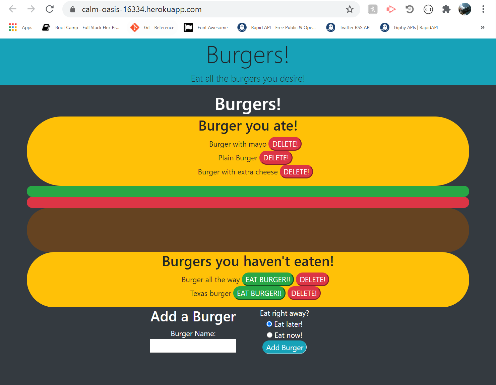

# Burger App

## Table of Contents
    
* [Description](#description)
* [Installation](#installation)
* [Usage](#usage)
* [Github](#github)

## <a name="description">Description:</a>
*    Add burgers to your list and either eat them right away or save them to eat later!

## <a name="installation">Installation:</a>
*    Visit https://calm-oasis-16334.herokuapp.com/ or run server.js in node and load http://localhost:8080/ on your local browser after loading the database into mysql.

## <a name="usage">Usage:</a>
*    To save burgers!

## <a name="github">Github URL:</a>
*    [https://github.com/Carlo-Defilippis/Burger_App](https://github.com/Carlo-Defilippis/Burger_App)
    